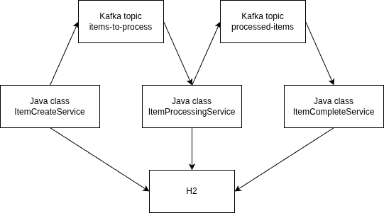

# Apache Kafka Introduction
The application is a demo presented during AKAI's workshop.
The repository contains basic Apache Kafka setup and simple Spring Boot 
application communicating with Apache Kafka using Protobuf.

## Ports
- 8080 - Spring Boot Application
- 8082 - H2 console (URL: jdbc:h2:tcp://localhost:9092/mem:testdb;DB_CLOSE_DELAY=-1;MODE=MySQL)
- 8090 - Kafka UI

## Diagram
